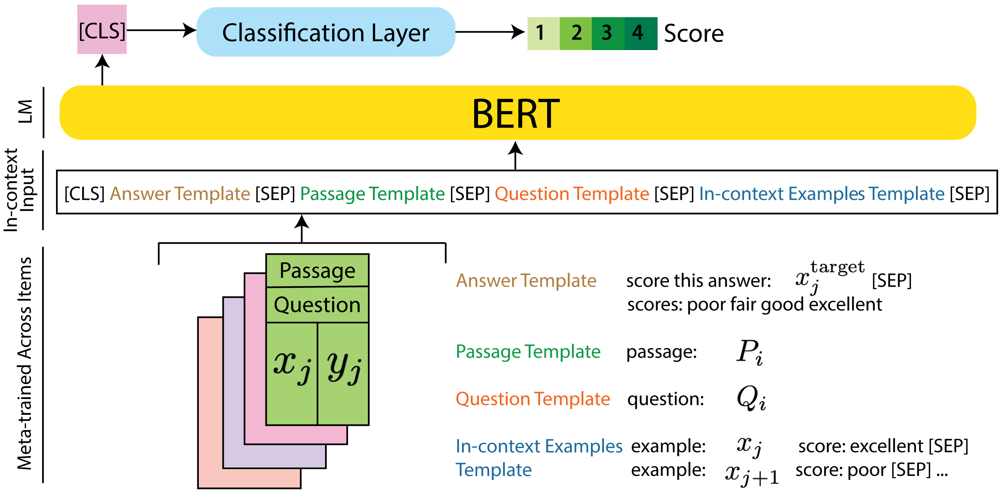

# [Automated Scoring for Reading Comprehension via In-context BERT Tuning](https://arxiv.org/abs/2205.09864)

We present our (grand prize-winning) solution to the [NAEP Automated Scoring Challenge](https://github.com/NAEP-AS-Challenge/info) for reading comprehension items. We develop a novel automated scoring approach based on meta-learning ideas via in-context tuning of language models. This repository contains the implementation of our best performing model *Meta-trained BERT In-context* and the BERT fine-tuning baseline from our paper [Automated Scoring for Reading Comprehension via In-context BERT Tuning](https://arxiv.org/abs/2205.09864) by [Nigel Fernandez](https://www.linkedin.com/in/ni9elf/), [Aritra Ghosh](https://arghosh.github.io), [Naiming Liu](https://www.linkedin.com/in/naiming-liu-lucy0817/), [Zichao Wang](https://zw16.web.rice.edu), [Benoît Choffin](https://benoitchoffin.github.io/about/), [Richard Baraniuk](https://richb.rice.edu), and [Andrew Lan](https://people.umass.edu/~andrewlan) published at AIED 2022.

<p align="center">
  
</p>

For any questions please [email](mailto:nigel@cs.umass.edu) or raise an issue.

If you find our code or paper useful, please consider citing:
```
@inproceedings{ fernandez2022AS,
  title={ Automated Scoring for Reading Comprehension via In-context {BERT} Tuning },
  author={ Fernandez, Nigel and Ghosh, Aritra and Liu, Naiming and Wang, Zichao and Choffin, Beno{\^{\i}}t and Baraniuk, Richard and Lan, Andrew },
  booktitle={ 23rd International Conference on Artificial Intelligence in Education (AIED 2022) },
  year={ 2022 }
}
```


## Contents

1. [Installation](#installation)
2. [Usage](#usage)
3. [Dataset](#dataset)
4. [Code Structure](#code-structure)
5. [Acknowledgements](#acknowledgements)

    

## Installation

Our code is tested with `Python 3.7.4` in a virtual environment created using:

```
virtualenv -p python3 env
```

Install the dependencies listed in the `requirements.txt` file by running:
```
pip install -r requirements.txt
```


## Usage
A [Neptune](https://neptune.ai) account is required to log train-test-val information (loss, metrics, etc). Best model checkpoints are saved locally.

To train-val-test a BERT baseline model for fine-tuning, please run:
```
python run.py\
    --name "lm_base_response_only"\
    --task "[name]"\
    --lm "bert-base-uncased"\
    --batch_size 32\
    --neptune_project "[name]"\
    --data_folder [name]\
    --cross_val_fold 1\
    --cuda\
    --neptune_project [name]\
    --neptune
```
To train-val-test our Meta-trained BERT In-context model, please run:
```
python run.py\
    --name "meta_lm_incontext"\
    --task "meta_learning_via_lm_incontext_tuning"\
    --lm "bert-base-uncased"\
    --batch_size 32\
    --neptune_project "[name]"\
    --meta_learning\
    --num_test_avg 8\
    --num_val_avg 8\
    --data_folder [name]\
    --cross_val_fold 1\
    --cuda\
    --neptune_project [name]\
    --neptune
```


Argument information:

`-h, --help` Show this help message and exit

`--name NAME` Name of the experiment

`--neptune_project NEPTUNE_PROJECT` Name of the neptune project

`--lm LM` Base language model (provide any Hugging face model name)

`--task TASK` Item name (not required for meta learning via in-context tuning)

`--demographic` Use demographic information of student

`--meta_learning` Enable meta-learning via BERT in-context tuning
  
`--num_test_avg NUM_TEST_AVG` Number of different sets of randomly sampled examples per test datapoint to average score predictions
  
`--num_val_avg NUM_VAL_AVG` Number of different sets of randomly sampled examples per val datapoint to average score predictions
  
`--num_examples NUM_EXAMPLES` Number of in-context examples from each score class to add to input
  
`--trunc_len TRUNC_LEN` Max number of words in each in-context example
  
`--lr_schedule LR_SCHEDULE` Learning rate schedule to use
  
`--opt {sgd,adam,lars}` Optimizer to use
  
`--iters ITERS` Number of epochs
  
`--lr LR` Base learning rate
  
`--batch_size BATCH_SIZE` Batch size
  
`--data_folder DATA_FOLDER` Dataset folder name containing train-val-test splits for each cross validation fold
  
`--cross_val_fold CROSS_VAL_FOLD` Cross validation fold to use
  
`--save_freq SAVE_FREQ` Epoch frequency to save the model
  
`--eval_freq EVAL_FREQ` Epoch frequency for evaluation
  
`--workers WORKERS` Number of data loader workers
  
`--seed SEED` Random seed

`--cuda` Use cuda
  
`--save` Save model every save_freq epochs
  
`--neptune` Enable logging to Neptune
  
`--debug` Debug mode with less items and smaller datasets
  
`--amp` Apply automatic mixed precision training to save GPU memory


## Dataset 
For our experimentation, we used the training dataset provided by the [NAEP Automated Scoring Challenge](https://github.com/NAEP-AS-Challenge/info) organizers. Please contact them for usage.

To run our approach for equivalent problems, the dataset structure expected is three separate train, validation and test json files, each containing a list of data samples represented as dictionaries `[{key:value}]`. Each data sample dictionary contains the following (key, value) pairs:
```
{'bl':[string], 'l1':[int], 'l2':[int], 'sx':[string], 'rc':[string], 'txt':[string]}  
```

The keys above are:

`'bl'`: Unique database like key to identify student response

`'l1'` : Score label by first human rater 

`'l2'` : Score label by second human rater (set as -1 if not available)

`'sx'` : Sex of student (optional, required if demographic argument is true)

`'rc'` : Race of student (optional, required if demographic argument is true)

`'txt'` : Student response text to the reading comprehension item to be scored 


## Code Structure
`models` contains `bert.py` and `meta_learning_via_bert_incontext_tuning.py` implementing BERT and meta-trained BERT in-context models, respectively.

`train` contains `train_bert.py` and `train_meta_learning_via_bert_incontext_tuning.py` implementing training scripts for BERT and meta-trained BERT in-context, respectively. 

`utils` contains `batch_collator.py` to collate batches for training, `load_data.py` to load train-val-test sets, and `utils.py` with general utility functions.


## Acknowledgements
Fernandez, Ghosh, and Lan are partially supported by the National Science Foundation under grants IIS-1917713 and IIS-2118706.